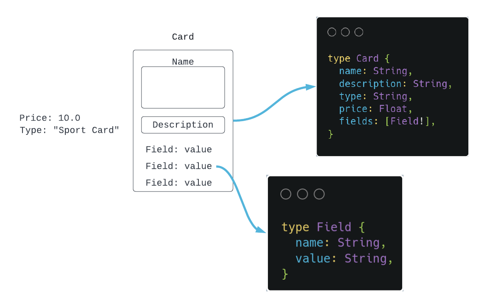

# Mycards

Mycards is a Graphql API to manage all types of trading cards. Built with Typescript, Apollo Server and MongoDB.

## Schema Overview



## Installation

Use the package manager npm or yarn to install the project.

```bash
npm install OR yarn install
```

## Getting Started

### Requirements

1. [docker](https://www.docker.com/)
2. [docker-compose](https://docs.docker.com/compose/)

Run the following command to start the MongoDB container.

```bash
docker-compose up -d
```

### Run the project

1. Copy .env.example to .env

```bash
cp .env.example .env
```

2. Gen graphql types

```bash
npm run gen OR yarn gen
```

3. Start the project

```bash
npm run dev OR yarn dev
```

4. Open your browser and visit [localhost:4000/graphql](http://localhost:4000/graphql)

## Author

[Christian Murata](https://github.com/christianmurata)
